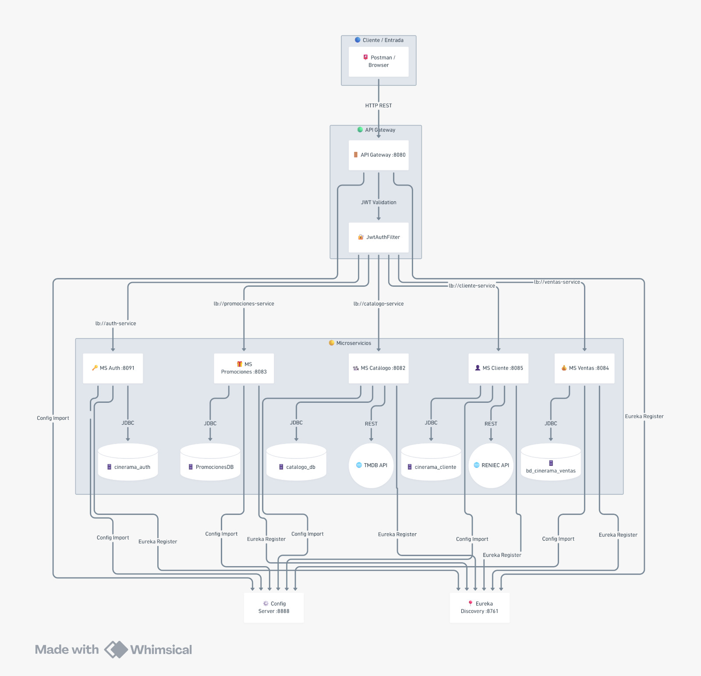

# 🎬 Cinerama — Guía de Inicio del Proyecto

> **Sistema de microservicios** para gestión de cines, cartelera, ventas y promociones.  
> Stack: Java 17 · Spring Boot 3 · Spring Cloud · PostgreSQL · JWT

***

## 📋 Tabla de Contenidos

- [🎬 Cinerama — Guía de Inicio del Proyecto](#-cinerama--guía-de-inicio-del-proyecto)
  - [📋 Tabla de Contenidos](#-tabla-de-contenidos)
  - [1. Arquitectura General](#1-arquitectura-general)
  - [2. Prerrequisitos](#2-prerrequisitos)
  - [3. Clonar el Repositorio](#3-clonar-el-repositorio)
  - [4. Configurar Variables de Entorno (`.env`)](#4-configurar-variables-de-entorno-env)
    - [4.1 — MS `auth` → `auth/.env`](#41--ms-auth--authenv)
    - [4.2 — MS `api-gateway` → `api-gateway/.env`](#42--ms-api-gateway--api-gatewayenv)
  - [5. Configurar Bases de Datos (PostgreSQL)](#5-configurar-bases-de-datos-postgresql)
    - [Verificar conexión](#verificar-conexión)
  - [6. Orden de Inicio de los Microservicios](#6-orden-de-inicio-de-los-microservicios)
    - [Cómo iniciar cada MS](#cómo-iniciar-cada-ms)
  - [7. Verificar que Todo Está Corriendo](#7-verificar-que-todo-está-corriendo)
    - [7.1 — Eureka Dashboard](#71--eureka-dashboard)
    - [7.2 — Verificar el API Gateway](#72--verificar-el-api-gateway)
  - [8. API Gateway — URLs Base](#8-api-gateway--urls-base)

***
## 1. Arquitectura General


## 2. Prerrequisitos

Asegúrate de tener instalado lo siguiente antes de continuar:

| Herramienta | Versión mínima | Verificar con |
|---|---|---|
| **Java (JDK)** | 17 | `java -version` |
| **Maven** | 3.8+ | `mvn -version` |
| **PostgreSQL** | 14+ | `psql --version` |
| **Git** | cualquier | `git --version` |
| **Postman** | cualquier | — |

> ⚠️ **IntelliJ IDEA / VS Code** recomendados para abrir el proyecto multi-módulo.

***

## 3. Clonar el Repositorio

```bash
git clone https://github.com/SandroCy6/DesarrolloWebIntegrado.git
cd DesarrolloWebIntegrado
```

Estructura del proyecto clonado:

```
DesarrolloWebIntegrado/
├── api-gateway/
├── auth/
├── catalogo/
├── cliente/
├── config-server/
├── discovery-server/
├── promociones/
└── ventas/
```

***
## 4. Configurar Variables de Entorno (`.env`)

Solo dos microservicios leen credenciales desde un archivo `.env`.  
Debes crear este archivo manualmente en la **raíz de cada módulo**.

---

### 4.1 — MS `auth` → `auth/.env`

```properties
# Base de datos
DB_URL=jdbc:postgresql://localhost:5432/cinerama_auth
DB_USERNAME=postgres
DB_PASSWORD=tu_password_aqui

# JWT — usa una cadena larga y aleatoria (mínimo 32 caracteres)
JWT_SECRET=clave_secreta_super_larga_y_segura_aqui_minimo_32chars
JWT_EXPIRATION=86400000
```

> 🔑 **JWT_SECRET:** Puedes generar una clave segura en:  
> [https://generate-secret.vercel.app/32](https://generate-secret.vercel.app/32)

---

### 4.2 — MS `api-gateway` → `api-gateway/.env`

```properties
# Debe ser EXACTAMENTE la misma clave JWT que pusiste en auth/.env
JWT_SECRET=clave_secreta_super_larga_y_segura_aqui_minimo_32chars
```

> ⚠️ **Importante:** `auth` firma el token con esta clave y `api-gateway` lo valida con la misma.  
> Si difieren, **todos los endpoints protegidos devolverán `401`** aunque el login funcione.

---


## 5. Configurar Bases de Datos (PostgreSQL)

Crea una base de datos en PostgreSQL por cada microservicio.  
Abre `psql` o pgAdmin y ejecuta:

```sql
-- Conéctate como superusuario (postgres)
CREATE DATABASE cinerama_auth;
CREATE DATABASE cinerama_catalogo;
CREATE DATABASE cinerama_cliente;
CREATE DATABASE cinerama_ventas;
CREATE DATABASE cinerama_promociones;
```

> ✅ Las tablas se crean automáticamente al iniciar cada MS gracias a:  
> `spring.jpa.hibernate.ddl-auto=update`  
> No necesitas ejecutar scripts SQL adicionales.

### Verificar conexión

```bash
psql -U postgres -d cinerama_auth -c "\dt"
```

Si muestra `Did not find any relations` es normal — las tablas aparecen al iniciar el MS por primera vez.

***


## 6. Orden de Inicio de los Microservicios

> ⚠️ **IMPORTANTE:** El orden es obligatorio. Si inicias los MS de negocio antes que Eureka, no se registrarán.

```
1️⃣  config-server      (opcional pero recomendado primero)
2️⃣  discovery-server   (Eureka — OBLIGATORIO antes que todo)
3️⃣  auth               (JWT — requerido por el gateway)
4️⃣  catalogo
5️⃣  cliente
6️⃣  ventas
7️⃣  promociones
8️⃣  api-gateway        (SIEMPRE ÚLTIMO — necesita que todos estén en Eureka)
```

### Cómo iniciar cada MS

**Opción A — Maven en terminal** (un terminal por MS):

```bash
# Ejemplo para auth
cd auth
mvn spring-boot:run

# Ejemplo para catalogo (nueva terminal)
cd ../catalogo
mvn spring-boot:run
```

**Opción B — IDE (IntelliJ IDEA recomendado):**

1. Abre el proyecto raíz en IntelliJ
2. Ve a `Run > Edit Configurations`
3. Agrega una configuración `Spring Boot` por cada módulo
4. Inícia en el orden indicado arriba


***


## 7. Verificar que Todo Está Corriendo

### 7.1 — Eureka Dashboard

Abre en el navegador:

```
http://localhost:8761
```

Deberías ver todos los microservicios registrados en la lista **"Instances currently registered with Eureka"**:

```
AUTH            UP (1)
CATALOGO        UP (1)
CLIENTE         UP (1)
VENTAS          UP (1)
PROMOCIONES     UP (1)
API-GATEWAY     UP (1)
```

> ⚠️ Si un MS no aparece, revisa sus logs — probablemente hay un error de conexión a la BD o `.env` faltante.


### 7.2 — Verificar el API Gateway

```bash
curl http://localhost:8080/actuator/health
# Esperado: {"status":"UP"}
```

O en Postman: `GET http://localhost:8080/actuator/health`

***

## 8. API Gateway — URLs Base

Todas las peticiones al sistema van por el puerto **8080** del API Gateway.  
**Nunca llames directamente a los puertos de los MS individuales** en producción.

| Microservicio | Prefijo en Gateway | Puerto directo |
|---|---|---|
| auth | `http://localhost:8080/auth/**` | :8091 |
| auth (usuarios) | `http://localhost:8080/usuarios/**` | :8091 |
| catalogo | `http://localhost:8080/catalogo/**` | :8082 |
| catalogo (cines) | `http://localhost:8080/api/cines/**` | :8082 |
| cliente | `http://localhost:8080/api/clientes/**` | :8081 |
| ventas | `http://localhost:8080/api/ventas/**` | :8084 |
| promociones | `http://localhost:8080/promociones/**` | :8083 |
| promociones (productos) | `http://localhost:8080/productos/**` | :8083 |

