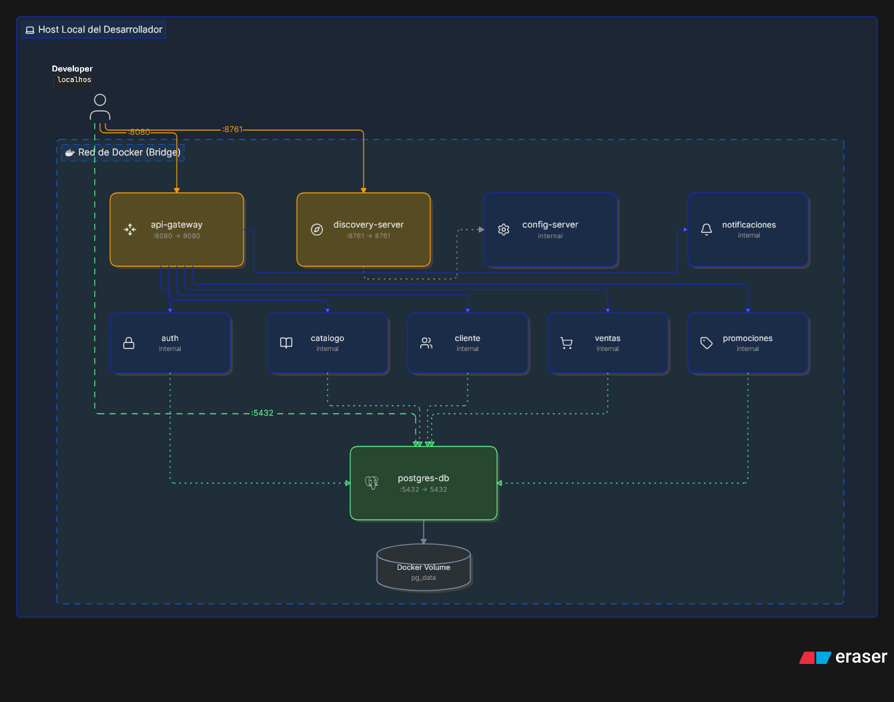

# Cinerama - Guía de Despliegue y Arquitectura

Sistema integral de microservicios para la gestión de cines, cartelera, ventas y promociones.
Desarrollado con **Java 17**, **Spring Boot 3**, **Spring Cloud** y **PostgreSQL**.

---

## Tabla de Contenidos
- [Cinerama - Guía de Despliegue y Arquitectura](#cinerama---guía-de-despliegue-y-arquitectura)
  - [Tabla de Contenidos](#tabla-de-contenidos)
  - [1. Descripción del Proyecto](#1-descripción-del-proyecto)
  - [2. Arquitectura del Sistema](#2-arquitectura-del-sistema)
  - [3. Requisitos Previos](#3-requisitos-previos)
  - [4. Configuración de Variables de Entorno](#4-configuración-de-variables-de-entorno)
  - [5. Despliegue con Docker Compose](#5-despliegue-con-docker-compose)
    - [Arquitectura de Contenedores en Local](#arquitectura-de-contenedores-en-local)
  - [6. Servicios y Puertos](#6-servicios-y-puertos)
  - [7. Consideraciones Adicionales](#7-consideraciones-adicionales)

---

## 1. Descripción del Proyecto

Cinerama es una plataforma distribuida que permite administrar la operativa completa de una cadena de cines. El sistema abarca el ciclo integral del negocio, desde la gestión del catálogo de películas y funciones, el registro de clientes y la emisión de boletos, hasta la aplicación de promociones y el envío de notificaciones.

## 2. Arquitectura del Sistema

El proyecto sigue un patrón de diseño basado en microservicios, apoyándose en el ecosistema de Spring Cloud para la resolución, enrutamiento y configuración distribuida:

* **API Gateway:** Punto de entrada único (Single Point of Entry) para todas las peticiones HTTP del cliente.
* **Discovery Server (Eureka):** Registro y descubrimiento dinámico de microservicios.
* **Config Server:** Centralización de las propiedades de configuración para todos los entornos.
* **Auth Service:** Gestión de identidades y seguridad mediante emisión/validación de tokens JWT.
* **Microservicios de Dominio:** Catálogo, Cliente, Ventas, Promociones y Notificaciones.
* **Base de Datos:** Motor PostgreSQL desplegado y administrado nativamente en contenedores.

## 3. Requisitos Previos

Para ejecutar el entorno local, se ha abstraído toda la complejidad de instalación de software base. Únicamente necesitas contar con:

* **Docker** y **Docker Compose** instalados en tu sistema.
* **Git** (para clonar el repositorio).

No se requiere configurar localmente Java, Maven ni PostgreSQL; todo el flujo de construcción y ejecución se encuentra encapsulado en el entorno Docker.

## 4. Configuración de Variables de Entorno

Antes de inicializar la infraestructura, es obligatorio definir las credenciales y variables de entorno del sistema (base de datos, secretos, puertos, etc.).

1. Ubícate en la raíz del repositorio.
2. Localiza el archivo plantilla `.env.example`.
3. Crea un nuevo archivo llamado `.env` basándote en la plantilla.
4. Completa los valores con tu configuración local.

Ejemplo de estructura mínima esperada en el archivo `.env`:

```properties
# Base de Datos PostgreSQL
POSTGRES_USER=postgres
POSTGRES_PASSWORD=tu_contrasena_segura

# Seguridad JWT (Debe ser idéntica para Gateway y Auth)
JWT_SECRET=clave_secreta_super_larga_y_segura_aqui_minimo_32chars
JWT_EXPIRATION=86400000
```

> **Nota:** La creación de los esquemas y las bases de datos de cada microservicio es automatizada. Ya no es necesario abrir clientes SQL o ejecutar sentencias de tipo `CREATE DATABASE` de forma manual.

## 5. Despliegue con Docker Compose

El proyecto incorpora un archivo `docker-compose.yml` que orquesta la construcción de las imágenes y la interconexión de redes entre todos los microservicios y la capa de persistencia.

### Arquitectura de Contenedores en Local



Para desplegar la aplicación completa, ejecuta el siguiente comando en la terminal desde la raíz del proyecto:

```bash
docker-compose up -d --build
```

Este proceso descargará las imágenes base, empaquetará los módulos correspondientes y levantará los servicios en segundo plano (`-d`). 

**Comandos útiles:**
* **Visualizar los logs generales en tiempo real:**
  ```bash
  docker-compose logs -f
  ```
* **Visualizar logs de un servicio específico (ej. api-gateway):**
  ```bash
  docker-compose logs -f api-gateway
  ```
* **Detener todos los servicios:**
  ```bash
  docker-compose down
  ```

## 6. Servicios y Puertos

Una vez finalizado el proceso de inicio, podrás interactuar con la plataforma y sus herramientas internas a través de los siguientes puertos locales predeterminados:

| Servicio | Puerto (Host) | Descripción |
| :--- | :--- | :--- |
| **API Gateway** | `8080` | Endpoint principal para consumo de APIs |
| **Discovery (Eureka)** | `8761` | Dashboard de registro y salud de servicios |
| **Config Server** | `8888` | Proveedor central de configuración |
| **Auth** | `8081` | Microservicio de Autenticación |
| **Catálogo** | `8082` | Gestión de películas y programación |
| **Cliente** | `8083` | Administración de usuarios |
| **Ventas** | `8084` | Procesamiento de pagos y boletos |
| **Promociones** | `8085` | Descuentos y campañas |
| **Notificaciones** | `8086` | Servicio de alertas y mensajería |
| **PostgreSQL** | `5432` | Persistencia relacional |

*(Los puertos expuestos pueden variar de acuerdo a la configuración final de tu `docker-compose.yml` y las variables inyectadas).*

## 7. Consideraciones Adicionales

* **Orden de Arranque Automático:** La dependencia entre servicios está controlada de manera nativa mediante las sentencias `depends_on` y directivas de `healthcheck` en Docker Compose. Esto asegura que los microservicios de dominio no se inicialicen hasta que la base de datos y Eureka estén funcionales.
* **Persistencia de Datos:** Toda la información almacenada en PostgreSQL se encuentra respaldada por un volumen persistente de Docker (`volumes`). Destruir el contenedor con `docker-compose down` no eliminará los registros de la base de datos (a menos que se especifique el flag `-v`).